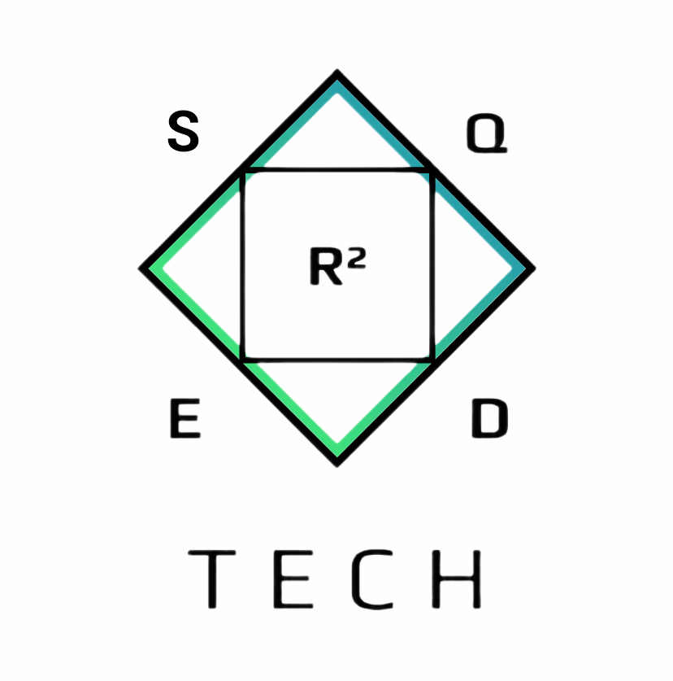

[//]: <> ()

## Welcome to this Portifolio

Here you will find many different open-source projects related either to my academic development or personal investment. All projects here were created or improved by me.

Feel free to contact, ask or discuss any of the content present here on rafaelazizlvr@gmail.com

### Summary

[](https://habitica.com/shops/market)

1. C language
- Upecman
- Sudoku Solver
- Number Reading

2. Python
- Hybrid System

```markdown
Syntax highlighted code block

# Header 1
## Header 2
### Header 3

- Bulleted
- List

1. Numbered
2. List

**Bold** and _Italic_ and `Code` text

[Link](url) and 
```

For more details see [GitHub Flavored Markdown](https://guides.github.com/features/mastering-markdown/).


### Jekyll Themes

Your Pages site will use the layout and styles from the Jekyll theme you have selected in your [repository settings](https://github.com/rafaziz/portifolio/settings/pages). The name of this theme is saved in the Jekyll `_config.yml` configuration file.

### Support or Contact

Having trouble with Pages? Check out our [documentation](https://docs.github.com/categories/github-pages-basics/) or [contact support](https://support.github.com/contact) and we’ll help you sort it out.
