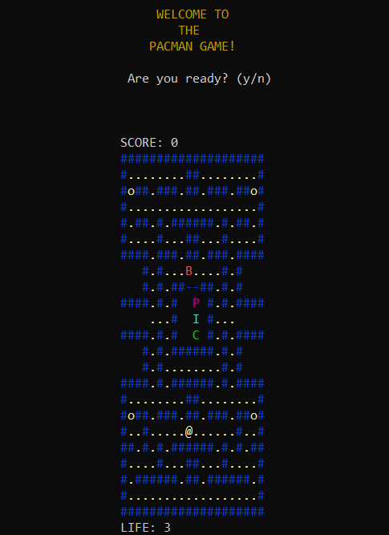

## Welcome to this Portifolio

Here you will find many different open-source projects related either to my academic development or personal investment. 

These projects were made using different programming languages and all of them were created or improved by me.

Feel free to contact, ask or discuss any of the content present here on rafaelazizlvr@gmail.com

<h2 id="summ">Summary</h2>

1. <a href="#CLan">C language</a>
- <a href="#upecman">Upecman</a>
- <a href="#ttt">Tic-Tac-Toe</a>
- <a href="#sudoku">Sudoku Solver</a>
- <a href="#numberR">Number Reading</a>

2. <a href="#py">Python</a>
- <a href="#hybridS">Hybrid System</a>
- <a href="#arc">Arcadia</a>

<h2 id="CLan">C language</h2>
<h3 id="upecman">Upecman</h3>

The upecman is a project developed during my first academic year. It is made using the the [ncurses](https://invisible-island.net/ncurses/announce.html) GNU library and many C language resources.

The goal here was to replicate the classic Pacman game in a terminal enviroment including all the caracteristics of the original game such as ghost's individual movement patterns, pacman and ghost's speed affected by level, cherry spawn, lives, points and all that could be applied to accomplish the goal.

You can check the detailed project here or download its files on github.

<a href="#summ">Back to Summary</a>

<h3 id="ttt">Tic-Tac-Toe</h3>

This project, as the name suggests, is the classic tic-tac-toe game made using the [ncurses](https://invisible-island.net/ncurses/announce.html) GNU library, C language resources and the AI min-max algorythm.

Upon start, the game offers 2 game mode options: Singleplayer and Local Multiplayer. If the player chooses multiplayer the game screen is presented and then, both players starts to play, but if the player chooses singplayer, a difficult screen is presented and after choosing the difficult, the player starts to play against the AI.

You can see the AI algorythm and more details about the project here or download the full codes on github.

<a href="#summ">Back to Summary</a>

<h3 id="sudoku">Sudoku Solver</h3>

The sudoku-solver is a program developed to automatically solve a sudoku challenge given as input file.

The program uses various known methods of sudoku resolution using C language to represent them and combine these methods to provide precise results as the dificult of the input challenges increases. Each method is responsible for the calculation of some specific situation of numbers and through them, excludes possible candidates of determined positions. The combination of these methods results in a faster, lighter and flawless output response.

You can view all methods and codes related to this program here or download the whole project on github.

<a href="#summ">Back to Summary</a>

<h3 id="numberR">Number Reading</h3>

The Number Reading is a Machine Learning (ML) project using a Artificial Neural Network (ANN) built in C language to indentify handwritten numbers with the lowest error rate that I could accomplish.

The ANN uses a combinantion of 10k different images compressed in a label in order to train and test its weights using 2 different activation functions, one for the hidden layer and the other for the remaining layers and later responding with error % of the ANN.

You can view the detailed information about the ANN and the whole project here, or download the whole code on github.

<a href="#summ">Back to Summary</a>

<h2 id="py">Python</h2>
<h3 id="hybridS">Hybrid System</h3>

The hybrid system is a project made using many Artificial Intelligence (AI) or Machine Learning (ML) optimization methods and the [sklearn](scikit-learn.org/) Python Library.

The objective of the system is to correctly make a temporal series analysis and predict the behaviour of a specific stock on the market combining at least 3 different methods of AI/ML applied to an input data. I chose the database of the past 5 years of the stock behavior, normalized and used as train material to the system in order for it to test and predict the future values of this stock in the market.

You can check the results and the details about this system here or download its code on github.

<a href="#summ">Back to Summary</a>

<h3 id="arc">Arcadia</h3>

Arcadia is a software designed to simulate [Google Stadia](https://stadia.google.com) gaming stream service and create a user registration system using a local database.

This project is made on Python 3 and uses many python libraries in order to create a functional system. This was firstly requested as a academic project to get familiarized with python features and later improved to get a cleaner and optimized result. Despite it being a simple software it fully accomplishes its main goal to create, edit and maintain a userbase and all attributes attained to each of then such as: Subscrition status, email, name, age etc.

You can find the detailed project here or download its files on github.

<a href="#summ">Back to Summary</a>

